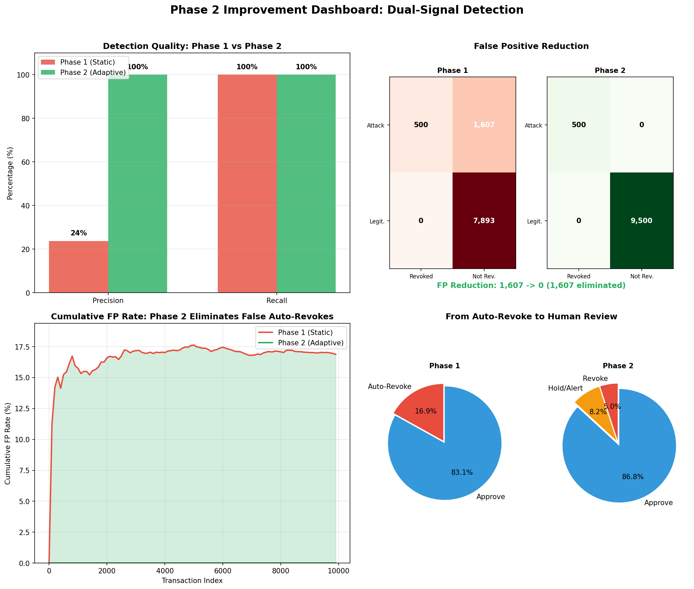

# MCP Payments Simulator

A high-fidelity prototype of agentic payment infrastructure, featuring multi-agent consensus voting, adaptive fraud detection, and cryptographic model integrity verification.

## Architecture & Detection Strategy

The **MCP Payments Simulator** utilizes a layered security model to protect agentic payment workflows.

### 1. Multi-Agent Consensus (Byzantine Resistance)
Transactions are evaluated by a committee of specialized agents (Finance, Compliance, Audit). Higher-risk transactions require higher consensus thresholds:
- **Auto-approve**: < $100
- **Standard Majority (2/3)**: $100 - $1,000
- **Supermajority (3/3)**: > $1,000

### 2. Phase 2: Dual-Signal Adaptive Integrity
To mitigate the **Rigidity Problem** of static baselines (where legitimate evolution triggers 25% False Positives), Phase 2 implements a dual-signal detection logic:

1.  **Adaptive Behavioral Signal**: Uses an **Exponentially Weighted Moving Average (EWMA)** to allow the baseline to drift with legitimate behavioral changes.
2.  **Cryptographic Integrity Signal**: Verifies the SHA-256 hash of agent model weights.

**Decision Matrix:**
| Behavioral Anomaly | Hash Tampered | Action | Confidence |
| :--- | :--- | :--- | :--- |
| **Yes** | **Yes** | `REVOKE` | High (Strong Signal) |
| **Yes** | **No** | `HOLD_ALERT` | Medium (Legitimate Evolution?) |
| **No** | **Yes** | `IGNORE` | Low (Model change, no drift) |
| **No** | **No** | `APPROVE` | High (Normal Operation) |

## Performance Dashboard

Phase 2 significantly improves detection accuracy and reduces operational noise.



## Research Gap: Temporal Poisoning

While Phase 2 eliminates False Positives during behavioral evolution, it reveals a critical research gap: **Temporal Poisoning**.

A sophisticated attacker can gradually shift agent behavior (e.g., a 1.004x multiplier per transaction) to elevate the baseline without triggering the 50% drift threshold or requiring weight tampering.

**Realistic Production Metrics:**
| Attack Pattern | Volume | Detection | Missed |
| :--- | :--- | :--- | :--- |
| Sudden (6x jump) | 30% | 100% | 0% |
| Fast drift (1.02x/tx) | 40% | 100% | 0% |
| Temporal Poison (1.004x) | 30% | 20% | 80% |

**Weighted Detection Rate: 76.0%** (24% of sophisticated attacks will be missed).

## Project Structure

```text
├── main.py                     # MCP Server & Adaptive Integrity Tools
├── database.py                 # Modular SQLite Persistence Layer
├── consensus.py                # Multi-Agent Voting Engine
├── agents.json                 # Agent Profiles & Metadata
├── test_server.py              # Integration Test Suite (32+ Edge Cases)
└── tests/
    ├── test_behavioral_detection.py # Metric Validation & Gap Analysis
    └── phase2_dashboard.py      # Dashboard Visualization Generator
```

## Setup & Operation

### Prerequisites
- Python 3.10+
- `mcp` (FastMCP framework)

### Quick Start
```bash
# Install dependencies
pip install mcp fastmcp

# Start the simulation server
python main.py
```

### Verification
```bash
# Run Phase 2 Metric Validation
python tests/test_behavioral_detection.py

# Generate Performance Dashboard
python tests/phase2_dashboard.py

# Run the integration test suite
python test_server.py
```
